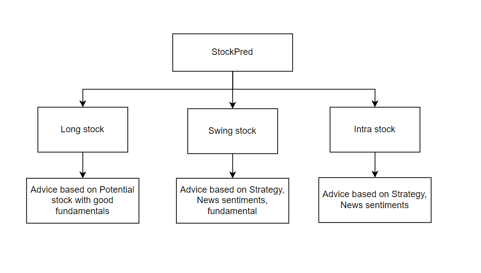

# IQInvest: Long-Term Investment Platform

IQInvest is an all-in-one investment advisory platform designed recommends stocks for long-term, short-term, and intraday investments, providing entry points, target prices, and stop-loss levels.It leverages stock fundamentals, news sentiment analysis, and effective trading strategies to make informed recommendations. This portion focuses on the long-term investment platform, which provides users with investment recommendations based on a simple statistical model and Modern Portfolio Theory (MPT).

## Project Flow Diagram



## Project Structure

```
IQInvest/
├── app/
│   ├── main.py            # API initialization and routing
│   ├── models.py          # Database models (SQLAlchemy)
│   ├── crud.py            # CRUD operations
│   ├── schemas.py         # Pydantic schemas for request/response validation
│   └── ml_models.py       # ML/statistical model functions (e.g., portfolio optimization)
├── config.py              # Configuration settings (database, API keys, etc.)
├── requirements.txt       # List of dependencies
└── Dockerfile             # Container setup for deployment
```

## Features

- **Portfolio Management**: Allows users to manage their long-term investments, including adding, viewing, and editing portfolios.
- **Investment Recommendations**: Generates data-driven recommendations based on Modern Portfolio Theory.
- **Analytics and Insights**: Displays key metrics, including returns, risk levels, and asset allocations.
- **Scalable Backend**: Built with FastAPI and integrated with a PostgreSQL database.

## Quick Start

### Prerequisites

- **Python 3.8+**
- **FastAPI**: A lightweight, asynchronous web framework.
- **PostgreSQL**: A relational database for persistent data storage.
- **Docker** (optional): For containerization and deployment.

### Installation

1. **Clone the Repository**
   ```bash
   git clone https://github.com/yourusername/IQInvest.git
   cd IQInvest
   ```

2. **Install Dependencies**
   ```bash
   pip install -r requirements.txt
   ```

3. **Database Setup**
   - Configure PostgreSQL and define tables in `models.py` (e.g., `User`, `Portfolio`, `Assets`, `Recommendations`).

4. **Run FastAPI**
   ```bash
   uvicorn app.main:app --reload
   ```

### Run with Docker

```bash
docker build -t iqinvest .
docker run -p 8000:8000 iqinvest
```

## Statistical Model Overview

The recommendation engine for long-term investments is built using **Modern Portfolio Theory (MPT)**, which optimizes the portfolio allocation based on expected return and risk.

### Model Steps

1. **Data Collection**:
   - Use `yfinance` to collect historical data for selected assets.
   - Example data collection code:
     ```python
     import yfinance as yf
     
     def get_historical_data(tickers, start="2018-01-01", end="2023-01-01"):
         data = {}
         for ticker in tickers:
             stock_data = yf.download(ticker, start=start, end=end)
             data[ticker] = stock_data["Adj Close"]
         return data
     ```

2. **Calculate Returns and Risk**:
   - Calculate daily or monthly returns for each asset.
   - Compute mean returns and covariance matrix for risk-return analysis.

3. **Portfolio Optimization**:
   - Use **Mean-Variance Optimization** to determine the best asset allocation for minimizing risk and maximizing return.
   - Example portfolio optimization function:
     ```python
     from scipy.optimize import minimize

     def optimize_portfolio(mean_returns, covariance_matrix, num_assets):
         constraints = ({'type': 'eq', 'fun': lambda x: np.sum(x) - 1})
         bounds = tuple((0, 1) for _ in range(num_assets))
         initial_weights = num_assets * [1.0 / num_assets]
         
         optimized = minimize(lambda w: -sharpe_ratio(w, mean_returns, covariance_matrix),
                              initial_weights, bounds=bounds, constraints=constraints)
         return optimized.x
     ```

4. **Generate Recommendations**:
   - The model generates optimal weights for each asset, which can be presented to the user as a recommended allocation.
   - Example recommendation output:
     ```python
     def generate_recommendations(tickers, optimal_weights):
         return {tickers[i]: weight for i, weight in enumerate(optimal_weights)}
     ```

## API Endpoints

- **/users/{user_id}/portfolio**: Fetch or update the user’s portfolio.
- **/recommendations/**: Generate recommendations based on selected assets.
- **/assets/{symbol}/history**: Get historical data for a specific asset.

### Sample API Request

```bash
POST /recommendations/
{
  "tickers": ["AAPL", "MSFT", "GOOGL"]
}
```

## Frontend Integration

### Web Frontend

1. **Framework**: React
2. **Visualization**: Use `Chart.js` to display portfolio distribution, asset trends, and risk analysis.

### Android Frontend

1. **Networking**: Retrofit for API calls.
2. **Visualization**: Use MPAndroidChart to show investment insights and recommendations.

## Deployment

### Docker

- Containerize the application for cloud deployment with **Docker**.

### Cloud Hosting (AWS, GCP, Azure)

1. **Database**: Host PostgreSQL on a managed database service.
2. **CI/CD Pipeline**: Use GitHub Actions or a similar tool for continuous integration and deployment.

## Future Enhancements

- **Advanced Model**: Integrate more complex models for enhanced recommendations.
- **Notifications**: Send alerts for significant portfolio events.
- **User Feedback**: Gather feedback to improve the user interface and recommendations.

## License

[MIT License](LICENSE)

---

This README provides an overview of the IQInvest long-term investment platform with a simple statistical model for generating recommendations. As you develop the platform, consider adding more advanced features to enhance the user experience and data-driven insights.
