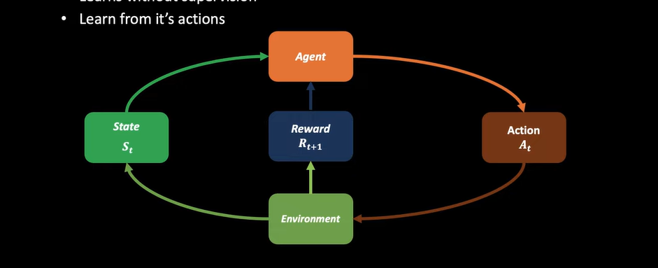

# 1\. Introduction to Reinforcement Learning in Day Trading

## Overview

All right guys, so welcome to this second video where we are going to introduce you to what reinforcement learning is. So we are going to introduce what reinforcement learning is in the context of day trading.

## The Concept of an Agent

Let's say, for example, you are a day trader. You're a day trader and what do you trade? Maybe you trade stocks, or you trade commodities, or cryptocurrencies, or ETFs, or Forex. In reinforcement learning, we want to teach an agent how to do all of these things.

### Defining the Agent

So, what is an agent? Let's take an example: you, as a day trader, can be called an agent. Trading stocks means every day you go to trade stock; thus, stock trading is your environment. Your market environment is the stocks environment. You are an agent that trades in the stocks environment.

## Market Environments and Learning

In reinforcement learning, we say that there's an AI agent in a market environment. That market environment can be the commodities, cryptocurrencies, ETFs, or currencies. So we say that there's an agent in a market environment.

### Learning Process

How does the agent learn? We know it's reinforcement learning; how does the agent learn? Let's go back to the example of you being a trader. How did you learn how to trade? You learned how to trade by losing money—hopefully not all the time. Most people learn that way; they usually say you have to lose money before you learn how to trade.

### Experience and Interaction

Most of you learn by making errors. You go into the market, you trade every day. That's why experience is key. You trade every day, lose money, and then as you’re losing, you’re learning. As you’re making money, you’re also learning. You learn what decisions you made to make money, what time is good to trade, and what time is not good to trade.

## Reinforcement Learning Mechanism

This is how you learn how to trade; it’s similar to what reinforcement learning does. We say that our agent interacts with the environment, and because you want to make money, you learn that taking certain decisions made you money.

### Decision Making

In reinforcement learning, we have an AI agent, and it’s going to learn a trading strategy. How is it going to learn a trading strategy? It’s going to learn from interacting with the market environment. It's going to buy and sell, doing this by trial and error. Whenever it buys and makes a profit, we give it a reward. If it doesn’t make a profit, we give it a negative reward, or we punish it.

### Iterative Learning

After doing this for several times, trial and error, it learns a trading strategy. It knows when it's good to trade and when it is not. This is how the AI agent learns to make decisions; it's a decision-making agent.

## Learning Without Supervision

Reinforcement learning is a decision-making learning system. This agent learns without supervision; we don’t supervise it. We just put it in the environment, and the only thing that motivates it, telling it if it’s right or wrong, is the reward.

### Actions and Feedback

It learns from its actions; trial and error are the actions it takes. In a day trading environment, it buys and sells, learns when to buy, when to sell, when not to buy, and when not to sell.

## Reinforcement Learning Paradigm

Let's put this together. We have a reinforcement learning paradigm that we want to explain.

### The Agent and the Environment

First, in reinforcement learning, we have an AI agent. Think of this agent as you, or an agent that you want to train to do trading for you. This agent operates in an environment. If you’re trading stocks, you put it in a stocks environment.

### State Representation

The environment produces what we call a state. Let’s say a state could be the price of Apple shares. The state gives you the price today, and the agent decides what to do. The agent takes an action based on that state.

### Reward System

When the agent takes an action, the environment gives it a reward. For example, if the agent buys Apple shares in the morning and the price goes up, the agent receives a positive reward. If it goes down, the agent receives a negative reward.

  

  

## Reinforcement Learning Explained

This is a simple way of explaining what reinforcement learning is. Your takeaway here is that we have an agent in an environment. The environment produces a state, the agent takes an action, and then the agent is given a reward.

## Example of Day Trading

Let’s see how we can go into a more explicit example using prices. Let’s say in a trading month, there are 30 days. For simplicity, let’s just look at the first nine days.

### Price Tracking

In a market environment, let's say these are the prices of Bitcoin on each day from Day 1 to Day 9. The price of Bitcoin on Day 1 is 22k. This value is given to the agent, and it must decide what action to take: buy, hold, or sell.

### Decision-Making Process

At this stage, the agent will take an action. If the agent decides to buy Bitcoin and the price remains the same, the reward is zero. If, however, on Day 3, the price drops to 20k, the agent loses points and receives a negative reward.

## Definition of Reinforcement Learning

To give a formal definition, reinforcement learning can be described as a framework for solving decision or control tasks. In the context of day trading, the agent learns to make trading decisions—buying or selling a stock—and receives rewards based on the results of those decisions.

## Conclusion

This is what the agent is doing in reinforcement learning. So, this is the introduction to reinforcement learning in the context of day trading.

##